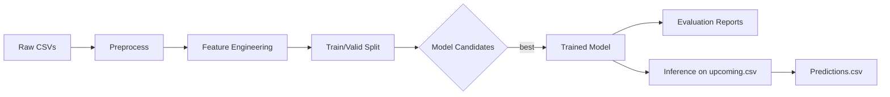

# UFC Fight Outcome Prediction System Architecture

## Objectives
- Binary classification: predict winner (Red vs Blue).
- Probability output: P(Red wins), P(Blue wins).

## Data Assets
- Kaggle “UFC-Fight-Dataset” (`data/ufc-master.csv`) – historical fights.
- `data/upcoming.csv` – future matchups for inference.
- Potential enrichments: fighter reach/height updates, betting odds, striking/grappling stats per round.

## Pipeline Stages
1. **Ingestion**
   - Read CSVs with robust encoding, parse event dates.
   - Store raw files unchanged for reproducibility.

2. **Cleaning / Normalisation** (`scripts/preprocess.py`)
   - Handle missing values (impute, drop, or flag).
   - Standardise units (height cm, reach cm, weight lbs).
   - One-hot encode categorical columns (stance, weight_class).
   - Create target label `winner`: 1 (Red), 0 (Blue).

3. **Feature Engineering** (`scripts/features.py`)
   - Derived metrics: age_at_fight, win-loss ratio, finish_rate, strike differential, grappling differential.
   - Time-decay on fighter stats (recent fights weighted higher).
   - Encode “short notice” fights (<30 days).
   - Feature scaling (StandardScaler / RobustScaler).

4. **Dataset Split & Resampling** (`scripts/dataset.py`)
   - Time-based split (train ≤ 2020, val 2021, test 2022+) to avoid leakage.
   - Optional stratified K-fold cross-validation.

5. **Modelling** (`scripts/model.py`)
   - Baselines: LogisticRegression, RandomForest.
   - Advanced: XGBoost / LightGBM, CatBoost.
   - Hyperparameter tuning via Optuna / GridSearchCV.
   - Save best model + feature importance.

6. **Evaluation** (`scripts/evaluate.py`)
   - Metrics: Accuracy, ROC-AUC, Brier Score.
   - SHAP values for interpretability.
   - Confusion matrix by year & weight_class.

7. **Inference** (`scripts/predict.py`)
   - Load trained model, transform `upcoming.csv` with same pipeline.
   - Output probabilities and predicted winner.
   - CLI: `python predict.py --input data/upcoming.csv --output predictions.csv`.

8. **Deployment (optional)**
   - FastAPI endpoint `/predict`.
   - Dockerfile with model & pipeline.
   - GitHub Actions: unit tests, lint, build + push image.

## Repository Layout
```text
data/
  raw/                 # original immutable files
  processed/           # cleaned & feature-engineered parquet
scripts/
  preprocess.py
  features.py
  dataset.py
  model.py
  evaluate.py
  predict.py
  utils.py
notebooks/
  eda.ipynb
models/
  best_model.pkl
docs/
  architecture.md
```

## Process Flow


## Milestones
| Day | Tasks |
|----|-------|
| 1-2 | EDA & cleaning functions |
| 3-4 | Feature engineering & dataset split |
| 5-6 | Baseline models, metrics pipeline |
| 7-8 | Hyper-tuning & feature importance |
| 9 | Inference script & README update |
| 10 | Optional API / Docker |

---